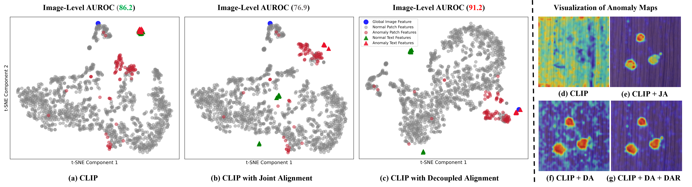

# DA-CLIP: DA-CLIP: Mitigating Granularity Mismatch in Zero-Shot Anomaly Detection via Decoupled Text-Visual Alignment

<!-- 这里的标签可以根据需要保留或删除 -->
[Submitted to CVPR2026] 
Official Pytorch Implementation of Mitigating Granularity Mismatch in Zero-Shot Anomaly Detection via Decoupled Text-Visual Alignment, 2025

<!-- 放置一张最能代表你项目的流程图或效果图 -->


## Abstract

<!-- 这里写你的摘要，可以参考 AA-CLIP 的写法：提出背景 -> 现有问题 -> 你的解决方法 -> 效果 -->
Recently, Vision-Language Models (VLMs) like CLIP have been widely adopted for zero-shot anomaly detection (ZSAD). Existing methods commonly perform a joint alignment of a single text feature with both global and local visual features. However, they overlook a core challenge: the granularity mismatch between the image-level classification and pixel-level segmentation tasks. In this work, we present our observation that joint alignment leads to two unexpected phenomena: 1) Performance degrades and is even inferior to the original CLIP, despite a clear separation between normal and abnormal text features. 2) The text features show a preference for aligning with local visual features, which enlarges the modality gap with global features and consequently harms classification performance. To address these issues, we propose a simple yet effective Decoupled Alignment framework (DA-CLIP). Our framework decouples feature alignment into two separate spaces using two independent text encoders, preventing mutual interference and effectively mitigating the granularity mismatch. Furthermore, to enhance the focus of text features on anomaly semantics rather than foreground object semantics, while preserving discriminability, we introduce a Decoupled Asymmetric Refinement (DAR) block, which dynamically refines the text features by incorporating fine-grained image priors. Extensive experiments on 11 industrial and medical datasets demonstrate that our method achieves state-of-the-art performance.

## Results
Coming sonn....

<!-- 展示你的实验结果，特别是可视化结果 -->
### Visualizations
Coming soon....


## Quick Start
Coming soon....

### 1. Installation
Coming soon....

```bash
# Clone the repository
git clone https://github.com/[你的Github用户名]/[你的仓库名].git
cd [你的仓库名]

# Create a conda environment
conda create -n daclip python=3.10 -y
conda activate daclip

# Install dependencies
pip install -r requirements.txt
